# Copy State Model

A **copy** is one person's physical book. One edition can have many copies across many owners. A copy's **state** is where it sits in the lending lifecycle right now. It drives what each screen shows and which actions are live. Every book card in the app is really rendering one of these states, so this is the model the circulation screens get designed from, and it maps one to one onto the loan table in `engineering/data-model.md`.

---

## The states

Six lifecycle states plus a derived **overdue** flag.

- **Available.** Lendable, on the shelf.
- **Requested.** A borrower asked. Owner has not answered. The copy is locked while in this state, no one else can request it.
- **Ready for pickup.** Owner approved the request. The copy is reserved for that borrower and off-market, but the loan has **not** started — the book is still physically with the owner. Handing it over is what starts the loan. Approval and handoff are two different moments (often days apart), so they are two states.
- **Checked out.** Lent, with a borrower. A due date is optional and, if set, its clock starts **at handoff**, not at approval. If set, the copy can go overdue; if not, the loan is open-ended. A copy reaches checked out two ways: the request path (requested → ready → checked out) or an owner-initiated **direct lend** (available → checked out, no request). The borrower may be a Stacks connection or an **off-app person** recorded as a free-text name.
- **Return pending.** Borrower marked it returned. Waiting on owner confirmation. Still counts as out. Only reachable for on-app borrowers — an off-app loan has no borrower to initiate a return, so the owner closes it directly.
- **Overdue.** Checked out with a due date that has passed. A derived flag on checked out, not a separate lifecycle branch. Only possible for loans that have a due date.
- **Unavailable.** Owner is keeping it off the lending market. They are reading it, or just want it on their shelf without lending. Remains visible to neighbors, but not borrowable.

---

## Decided rules

These were settled in planning and are baked into the model below.

- **Approve and hand off are two steps.** Approving a request moves the copy to *ready for pickup* (reserved, off-market) — not straight to checked out. A separate "mark as handed over" starts the loan and the due-date clock. This keeps due dates honest (the clock starts when the borrower actually has the book) and tells the borrower they're approved before the two meet. Coordinating the physical swap stays outside the app for the POC; the model just represents the two moments as two states. *(Supersedes the earlier "approve → checked out in one step" call — see decision-log.)*
- **Owners can lend without a request.** A "Lend" action on any available copy checks it out directly, no request needed — the common "here, take it" case. It skips *requested* and *ready* and lands in checked out.
- **A borrower can be off-app.** For a direct lend, the borrower may be someone not on Stacks, recorded as a free-text name. Off-app loans have no borrower-side app, so the owner marks the return directly (no return-pending step). The tracking value — knowing who has your book — must not require the borrower to have an account.
- **Owner is authoritative on returns.** The borrower can initiate a return, but the copy stays in return pending until the owner confirms. The owner can dispute, which bounces it back to checked out. (An off-app loan is closed by the owner marking it returned directly.)
- **Optional due date.** Owners can approve a loan with no due date. A no-due-date loan stays checked out open-ended and never goes overdue. The loans view therefore renders two checked-out variants: "due [date]" and open-ended "checked out, no due date."
- **One request per copy at a time, and the request locks the copy.** The moment someone requests, the copy flips to requested and leaves the market. No one else can request it. The owner's approve or decline is what releases it. This removes any queue, concurrency, or first-approved-wins logic.
- **Decline carries no reason.** The borrower simply sees the request was declined. The decline action prompts the owner to choose the copy's next state: back to available, or straight to unavailable.
- **Request labels are role-specific.** The requester sees their own request as "Request pending." Any other neighbor sees the copy as "On hold," with no requester name attached, keeping the request private between requester and owner.
- **Unavailable stays visible.** Neighbors can see the owner has the book, marked not available for lending, with no request button.
- **Overdue is shown but not nudged in the POC.** The flag renders. No reminders or automation yet.

---

## Transitions

```mermaid
stateDiagram-v2
    [*] --> Available
    Available --> Requested: borrower requests (copy locks)
    Available --> CheckedOut: owner lends directly (no request; due optional)
    Available --> Unavailable: owner flags off-market
    Unavailable --> Available: owner re-enables
    Requested --> Ready: owner approves (reserves the copy)
    Requested --> Available: owner declines, picks available
    Requested --> Unavailable: owner declines, picks unavailable
    Ready --> CheckedOut: owner marks handed over (due optional, clock starts)
    Ready --> Available: owner or borrower cancels before pickup
    CheckedOut --> ReturnPending: borrower marks returned (on-app only)
    CheckedOut --> Available: owner marks returned directly
    CheckedOut --> Overdue: due date passes
    Overdue --> ReturnPending: borrower marks returned
    Overdue --> Available: owner marks returned directly
    ReturnPending --> Available: owner confirms receipt
    ReturnPending --> CheckedOut: owner disputes, did not receive
```

Notice the load-bearing bits. Requesting locks the copy, so requested is a dead end for every other browser until the owner acts. Approval routes through **ready** rather than jumping to checked out — the loan only truly starts at handoff, and *ready* can cancel back to available if the pickup never happens, so that needs its own path. There's a second on-ramp to checked out: an owner **direct lend** straight from available, skipping request and ready. Decline is a single owner action that forks into two destinations, so the decline screen needs that choice built in. And return pending can bounce back to checked out if the owner says they never got it, so that dispute path needs a real button, not just a happy-path confirm — while an off-app loan skips return pending entirely and is closed by the owner.

---

## State by role grid

The grid to design each book card against. Columns: what the **owner** sees and can do, what a **browsing neighbor** sees and can do, and the **visual treatment**.

| State | Owner sees / can do | Neighbor sees / can do | Visual treatment |
|---|---|---|---|
| **Available** | "Available." Actions: **lend to someone** (direct lend, connection or off-app name), mark unavailable, edit copy | Normal cover. Action: request to borrow | Normal cover, subtle available badge |
| **Requested** | "Requested by [name]." Actions: approve (→ ready), or decline (then pick available or unavailable) | Requester sees "Request pending," can cancel. Everyone else sees "On hold," no name, no request button | Amber pending badge |
| **Ready for pickup** | "Ready for pickup — reserved for [name]." Actions: mark as handed over (set optional due date, starts the loan), or cancel | Requester sees "Approved · arrange pickup." Everyone else sees "On hold," no name | Green reserved badge |
| **Checked out** | "Checked out to [name]," with "due [date]" or "no due date"; off-app loans flagged "not on Stacks." Action: mark returned directly; if on-app, borrower can also initiate | "Checked out." Shows a return-by date if one is set. No request button | Muted cover, out badge, due date or open-ended label |
| **Return pending** | "[name] marked this returned. Confirm?" Actions: confirm returned, or did not receive it (bounces to checked out) | Borrower sees "Return submitted, awaiting confirmation" | Blue pending badge. Still counts as out |
| **Overdue** | "Overdue, was due [date], with [name]." Action: mark returned | Borrower sees an overdue flag on their borrowed item. Action: mark returned | Red badge |
| **Unavailable** | "Not available for lending." Action: make available | Sees the owner has it, marked not available for lending. No request button | Slightly muted cover, neutral not-lending badge |

---

## Deferred, not in the POC

Recorded so they are not rediscovered as bugs later. Full list in `decisions/open-questions.md`.

- **Auto-expiring requests.** A stale request should eventually release the lock back to available. Deferred. For the POC a request holds the copy until the owner acts.
- **Notify when available.** Because unavailable and checked-out copies stay visible, a future "tell me when this frees up" fits naturally. Not built yet.
- **Overdue nudges and any notification automation.**
- **Multiple concurrent requests or a queue.** Explicitly out. One request per copy is the rule.
