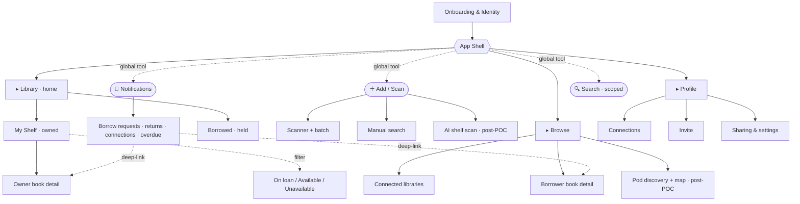
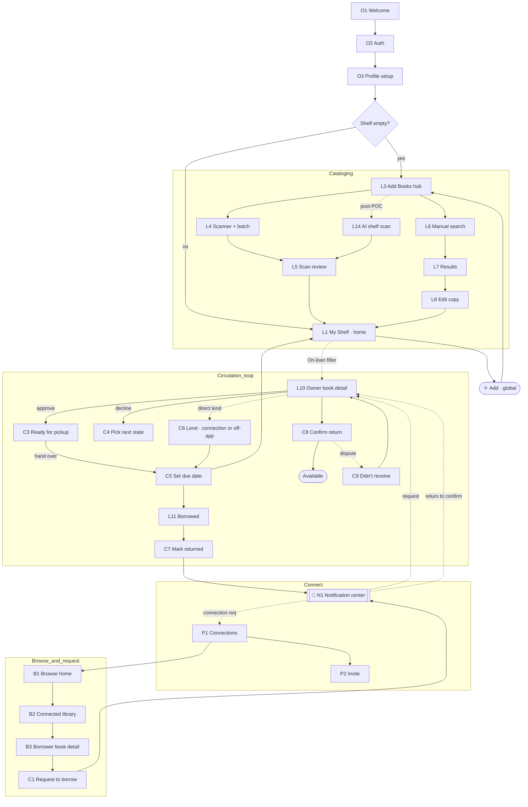
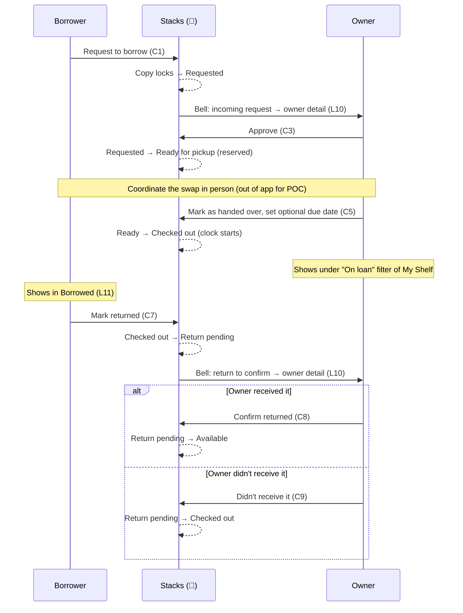

# Information Architecture

The master scaffold for Stacks: the navigation model, the full screen inventory across every feature area, the IA tree, the navigation graph, and the key journey maps. This is the structural blueprint the app is built against — design and build individual screens against the slot each one occupies here.

**Scope note.** This document covers the **whole app**, not just the POC. `journeys-and-screens.md` is the POC cut (the tighter critical path); this file is the superset it lives inside. Every screen is tagged so the POC boundary stays visible:

- **[POC]** — on the proof-of-concept critical path. Must exist to prove request-to-return between two users.
- **[Fast follow]** — wanted immediately after the POC; stubbable or defaulted in the first prototype.
- **[Post-POC]** — a later feature area (AI shelf scan, push/notification automation, pods/map, trust & safety, messaging). Placed in the structure now so nothing has to be re-architected to add it. Maps to deferred items in `../decisions/open-questions.md` and feature areas F–H in `prd.md`.

Copy states referenced throughout are defined in `../circulation/copy-state-model.md`. Feature areas (A–H) map to `prd.md`. Navigation is settled in `../design/design-decision-log.md` ("Full-app IA scaffold: three tabs, global tools, notification center" — which supersedes the earlier four-tab entry).

---

## 1. Navigation model

One app shell serves both roles — Steward and Borrower — because most people are both (settled: `design/design-decision-log.md`, "App shell: one experience with modes"). There are no separate steward/borrower modes; the same screens surface owner or borrower actions based on whether a copy is yours.

**The governing rule: the bottom bar holds *destinations*, not *actions*.** Places you go are tabs. Things you *do* — add a book, search, deal with what needs you — are global tools available from everywhere, not tab slots. This keeps the thumb-zone bar small and stable, and it's why Add, Search, and Notifications are not tabs.

### Primary navigation — three tabs

| Tab | Job | Contains | Home? |
|---|---|---|---|
| **Library** | *All the books in my life — owned or held.* | **My Shelf** (owned copies; filter by Available / On loan / Unavailable) + **Borrowed** (copies I'm holding from neighbors, with due dates + return) | **Yes — default landing** |
| **Browse** | *Find something to borrow.* | Connected neighbors' shelves; discovery; the borrower side of a book | — |
| **Profile** | *Me, my people, my settings.* | Connections, invite, sharing default, account | — |

**Library is home.** The app opens straight into My Shelf. The core payoff — watching your own catalogued shelf fill up — is the hook (Principle 1: never gate the first win behind another person or an extra hop). We deliberately did **not** add a separate Home/dashboard tab: a "what's new" aggregator is empty at cold-start and drifts toward the social-feed / institutional-dashboard look listed in our anti-references. Any "what needs you" moment is a slim strip atop Library, not a tab.

### Global tools — available from everywhere, not tabs

| Tool | Affordance | Job | Scope / notes |
|---|---|---|---|
| **＋ Add / Scan** | FAB / Library-header action | Catalog a book | Highest-frequency action; opens the method picker (scan default). Empty library routes here. |
| **🔔 Notifications** | Bell in the header, everywhere | Surface what needs a decision, deep-link to where the action lives | In-app, badge-driven **inbox of pending items** for both roles: incoming borrow requests, returns to confirm, connection requests, approvals, overdue flags. Replaces a Requests tab. |
| **🔍 Search** | Header search, contextual | Find a specific title | In Library → searches **my** shelf; in Browse → searches **connected** libraries. A unified global search comes later, returning results **grouped by scope** (My Shelf / Neighbors) so "I own this" never blurs with "a neighbor owns this." |

**Why the notification center replaces a Requests tab.** The old Requests tab was doing two unlike jobs at once: surfacing *events that need a tap* (a borrow request arrived, a return needs confirming) and holding *standing lists* (what's out, what I've borrowed). Those split cleanly:

- **Events → the bell.** Ephemeral, badge-driven, reachable from anywhere, deep-linking into the screen where the action lives. Better than a tab: convergence *and* omnipresence.
- **Standing state → Library.** "On loan" is a filter on My Shelf (they're still your copies); "Borrowed" is a segment of Library (books in your hands right now). These are lists you return to, so they belong in a destination, not an ephemeral inbox.

**POC scope on notifications.** The bell is an **in-app, pull-based center** — no push infrastructure, no overdue automation. That stays consistent with the settled "in-app badges only for the POC" rule (`../decisions/decision-log.md`). Push notifications, overdue nudges, and messaging (handoff coordination, "notify when available") remain **Post-POC** (feature area F).

---

## 2. IA tree (sitemap)

Indentation is containment (a child is reached from its parent). Tags mark the POC boundary. Circulation *actions* (approve, decline, checkout, confirm, dispute) are reached contextually — from the bell or from a book/loan detail — not from a dedicated tab; they're grouped under Circulation for reference.

```
Stacks
│
├── Onboarding & Identity  (pre-shell, one-time)
│   ├── Welcome / value prop                      [POC]
│   ├── Sign in / Sign up  (Supabase, Apple)      [POC]
│   ├── Profile setup  (name, photo, approx loc)  [POC]
│   └── First-run prompt → Scanner                [POC]
│
├── ▸ LIBRARY  (tab · home)
│   ├── My Shelf  (owned; grid/list, search, filter) [POC]
│   │   ├── Filter: Available / On loan / Unavailable [POC]
│   │   ├── Empty state → Add                     [POC]
│   │   └── Owner book detail                     [POC]
│   │       ├── Edit your copy  (loc/condition/status/visibility) [POC]
│   │       ├── Borrow history                    [POC]
│   │       └── Owner circulation actions  (see Circulation) [POC]
│   ├── Borrowed  (held from neighbors)           [POC]
│   │   └── Borrowed book detail → mark returned  [POC]
│   ├── Add Books  (global tool · method picker)  [POC]
│   │   ├── Barcode scanner + batch               [POC]
│   │   ├── Scan review & confirm                 [POC]
│   │   ├── Manual search → results → edit copy   [POC]
│   │   ├── Add manually  (no ISBN match)         [Fast follow]
│   │   ├── Add success / continue                [POC]
│   │   ├── AI shelf scan  (photo → multi-detect) [Post-POC]
│   │   ├── Printed-ISBN OCR                       [Post-POC]
│   │   └── CSV / Goodreads import                 [Post-POC]
│   └── Shelves & tags  (custom organization)     [Post-POC]
│
├── ▸ BROWSE  (tab)
│   ├── Browse home  (your connected libraries)   [POC]
│   ├── A connected library  (one neighbor)       [POC]
│   ├── Borrower book detail  (request to borrow) [POC]
│   ├── Search across connected libraries         [Fast follow]
│   └── Neighborhood / pod discovery + map        [Post-POC]
│
├── ▸ PROFILE  (tab)
│   ├── Profile home  (me, my stats)              [Fast follow]
│   ├── Connections list                          [POC]
│   ├── Invite  (share link / code / contacts)    [POC]
│   ├── Sharing & visibility settings             [Fast follow]
│   ├── Account & settings                         [Fast follow]
│   └── Trust & safety  (identity, meet points)   [Post-POC]
│
├── ○ NOTIFICATIONS  (global · bell, not a tab)
│   ├── Notification center  (in-app inbox)       [POC]
│   │   ├── Incoming borrow request → owner detail [POC]
│   │   ├── Return to confirm → owner detail       [POC]
│   │   ├── Connection request → approve/decline   [POC]
│   │   ├── Approval / decline outcome  (borrower)  [POC]
│   │   └── Overdue flag  (shown, not nudged)       [POC]
│   ├── Push notifications  (infra)                [Post-POC]
│   └── Messaging  (handoff coord, notify-when-free) [Post-POC]
│
├── ◇ CIRCULATION  (actions, reached contextually — no tab)
│   ├── Request to borrow  (borrower, from Browse) [POC]
│   ├── Cancel request  (borrower)                 [POC]
│   ├── Approve → set optional due date  (owner)   [POC]
│   ├── Decline → pick next state  (owner)         [POC]
│   ├── Checkout action  (owner)                   [POC]
│   ├── Mark returned  (borrower)                   [POC]
│   ├── Confirm return  (owner)                     [POC]
│   └── Dispute return — "didn't receive it"        [POC]
│
└── ▸ SYSTEM / CROSS-CUTTING  (appears everywhere)
    ├── Tab bar  (Library · Browse · Profile)     [POC]
    ├── Global search  (grouped by scope)         [Fast follow]
    ├── Loading / empty / error states            [POC]
    └── Confirmation & action sheets              [POC]
```

---

## 3. IA diagram

Three destinations off the shell, onboarding feeding in, and the global tools (Add, bell, Search) floating above every tab rather than sitting in the bar.



---

## 4. Complete screen inventory

Every screen, numbered by area for stable reference. `O#` onboarding, `L#` Library, `B#` Browse, `P#` Profile, `N#` Notifications, `C#` Circulation action, `S#` System. Cite these IDs when specifying a screen.

### O — Onboarding & identity
- **O1. Welcome / value prop** [POC] — Answer "why bother." Lead with the neighborhood-library idea. Brand-register moment.
- **O2. Sign in / Sign up** [POC] — Supabase auth; Sign in with Apple primary on iOS.
- **O3. Profile setup** [POC, light] — Name, optional photo, approximate location. One screen.
- **O4. First-run prompt** [POC] — "Let's add your first books." Routes into L4 scanner. The empty state doing real work.

### L — Library (home: My Shelf + Borrowed + cataloging)
- **L1. My Shelf** [POC] — Your owned copies. Grid/list, search-within, status filter. Default landing screen of the app.
- **L1a. Status filter** [POC] — Available / On loan / Unavailable. **"On loan" is where books you've lent out live** — each row links to L10.
- **L2. Empty shelf state** [POC] — Routes into Add. Does real work, not a dead end.
- **L3. Add Books hub / method picker** [POC] — Scan (default), search, manual. Global tool, reachable anywhere.
- **L4. Barcode scanner + batch** [POC] — Live camera, running count, per-hit confirmation. Highest-polish screen; first impression.
- **L5. Scan review & confirm** [POC] — Batch as an editable list. Never adds silently.
- **L6. Manual search** [POC] — Title/author. First-class camera fallback.
- **L7. Search results** [POC] — Pick the right edition; cover, title, author, year.
- **L8. Book detail: edit your copy** [POC] — Canonical metadata read-only, then your copy: location, condition, status, visibility. Where an edition becomes your lendable copy.
- **L9. Add success / continue** [POC, light] — Keeps momentum to the next book.
- **L10. Owner book detail** [POC] — Copy state, who has it, due date, borrow history; owner circulation actions live here (C-series).
- **L11. Borrowed** [POC] — Books you're holding from neighbors. Due dates + return action. A segment of the Library tab, not part of your catalog grid.
- **L12. Borrowed book detail** [POC] — The copy you hold; mark-returned action (C6).
- **L13. Add manually (no ISBN match)** [Fast follow].
- **L14. AI shelf scan** [Post-POC] — Photo → multi-detect → feeds L5. The differentiator (area A).
- **L15. Printed-ISBN OCR** [Post-POC].
- **L16. CSV / Goodreads import** [Post-POC].
- **L17. Shelves & tags** [Post-POC] — Custom organization (area B).

### B — Browse (neighbors' shelves)
- **B1. Browse home** [POC] — Your connected libraries; surfaces availability.
- **B2. A connected library** [POC] — One neighbor's shelf; availability per copy.
- **B3. Borrower book detail** [POC] — Availability + "Request to borrow." Renders the neighbor view of the copy state.
- **B4. Search across connected libraries** [Fast follow] — "Who near me has this title" (area D).
- **B5. Cross-library search results** [Fast follow] — Ranked by availability + proximity.
- **B6. Neighborhood / pod discovery + map** [Post-POC] — Open local discovery once density exists (area H).

### C — Circulation actions (reached from the bell or a book/loan detail — no tab)
- **C1. Request to borrow** [POC] — Borrower action from B3; locks the copy → Requested.
- **C2. Cancel request** [POC] — Borrower; releases the lock back to available.
- **C3. Approve → Ready for pickup** [POC] — Owner; reserves the copy for the requester (off-market). Does **not** start the loan.
- **C4. Decline → pick next state** [POC] — Owner; one action forks to available or unavailable. No reason captured.
- **C5. Mark as handed over** [POC] — Owner; from Ready, sets optional due date and starts the loan → Checked out. The due-date clock starts here, at handoff.
- **C6. Lend directly** [POC] — Owner-initiated from an available copy, no request. Borrower picker: a connection **or** a free-typed off-app name → optional due date → Checked out.
- **C7. Mark returned** [POC] — Borrower (on-app); copy → return pending.
- **C8. Confirm return** [POC] — Owner confirms receipt → available. Off-app loans are closed here directly (no return-pending).
- **C9. Dispute return** [POC] — "Didn't receive it" bounces return pending → checked out. A real button, not just happy-path.

### N — Notifications (global bell)
- **N1. Notification center** [POC] — In-app, badge-driven inbox of pending items for both roles: incoming requests, returns to confirm, connection requests, approval/decline outcomes, overdue flags. Deep-links to the screen where each action lives. No push, no automation.
- **N2. Push notifications infrastructure** [Post-POC] — Area F.
- **N3. Messaging** [Post-POC] — Handoff coordination, "notify when available."

### P — Profile, connections & settings
- **P1. Connections list** [POC] — People you're connected to; entry to their library.
- **P2. Invite** [POC] — Share link/code, contacts if native. How the second demo user gets in.
- **P3. Profile home** [Fast follow] — You, light stats.
- **P4. Sharing & visibility settings** [Fast follow] — POC ships the single "visible to connections" default.
- **P5. Account & settings** [Fast follow, light].
- **P6. Trust & safety** [Post-POC] — Identity, meet points, reputation (area G).

### S — System / cross-cutting
- **S1. Tab bar** [POC] — Library · Browse · Profile.
- **S2. Global search** [Fast follow] — Across own + connected libraries, results grouped by scope.
- **S3. Loading / empty / error states** [POC].
- **S4. Confirmation & action sheets** [POC] — The modal/overlay layer (see §6).

**POC critical set: ~26 screens.** Full app across all feature areas: ~42 screens.

---

## 5. Navigation graph

How screens connect in use — owner and borrower paths together, since one person does both. The bell (N1) is the cross-role convergence point that routes events into the detail screens where actions live.



**Reading the loop:** a request (C1) locks the copy and lands in the owner's bell (N1); the owner opens it (L10) and approves, which reserves it as *Ready for pickup* (C3) — the loan hasn't started yet; a separate "mark as handed over" sets the due date (C5) and starts the clock. A copy can also skip the request entirely via an owner **direct lend** (C6) to a connection or an off-app name. The lent copy shows under the "On loan" filter of My Shelf and in the borrower's Borrowed (L11); the borrower returns it (C7), the owner confirms (C8) — or disputes (C9); off-app loans are closed by the owner at C8 directly. This mirrors the state machine in `../circulation/copy-state-model.md` one-to-one.

---

## 6. Modal, sheet & overlay inventory

Transient surfaces layered over the tabs — designed deliberately, not invented per-screen.

| Overlay | Trigger | Type | Notes |
|---|---|---|---|
| Add / method picker | Global Add | Action sheet | Scan · Search · Manual. Default-focus scan. |
| Per-scan hit toast | Each match in L4 | Inline toast | Instant feedback + running count. Reduced-motion fallback. |
| Edition disambiguation | Ambiguous scan/search | Bottom sheet | Pick the right edition without leaving the batch. |
| Set due date | Hand over (C5) / Lend (C6) | Bottom sheet | Optional; "Due in 2 weeks / Custom date… / No due date." Clock starts at handoff. |
| Lend — borrower picker | Lend (C6) | Bottom sheet | Connections list + free-text "Someone not on Stacks" name. |
| Decline → next state | Decline (C4) | Bottom sheet | Forks to available/unavailable in one step. |
| Confirm return / dispute | C8 / C9 | Confirm sheet | Two paths: "Confirm returned" vs "I didn't receive it." |
| Cancel request | C2 | Confirm sheet | Low-friction; releases the lock. |
| Mark unavailable / available | L10 | Toggle + sheet | Off-market flag; non-punitive copy. |
| Invite share | P2 | Native share sheet | Link/code; contacts if permitted. |
| Notification center | Bell tap | Sheet / panel | In-app inbox; each row deep-links to its action screen. |
| Empty & error states | Any data-less/failed screen | Inline | Empty shelf routes to Add; errors offer retry. |

---

## 7. Cross-cutting: the copy-state layer

The single most reused component is the **book card**, and every book card renders one copy state (settled: `design/design-decision-log.md`, "Copy state drives every book card"). The same card vocabulary appears in My Shelf (L1), Owner book detail (L10), Borrowed (L11), Browse (B2), Borrower book detail (B3), and the notification center rows (N1) — only the role and available actions change.

The states (available, requested, ready for pickup, checked out, return pending, overdue, unavailable), their role-specific labels, and visual treatments are the source of truth in `../circulation/copy-state-model.md` (state-by-role grid). Two circulation calls also live there: approve and handoff are **two steps** (approve → ready → checked out), and a copy can reach checked out via an owner **direct lend** to a connection or an off-app borrower. Two IA consequences: the card takes *viewer role* as an input, not just copy state (a requester sees "Request pending," a third-party neighbor sees "On hold" with no name); and state is never signaled by color alone — every badge pairs color with a label/icon, a component-level contract every screen inherits.

---

## 8. Key journey maps

The two POC role journeys (Steward, Borrower) live in full in `journeys-and-screens.md §2–3`. Below are the **cross-role and lifecycle journeys** the tab structure must support.

### 8.1 First-run → first value (the activation journey)

Catalog value must land before any neighbor exists (Principle 1).

| Stage | Screens | Goal | Success signal | Risk |
|---|---|---|---|---|
| Land | O1 | Get why it's worth effort | Reads past the pitch | Value abstract before neighbors exist → lead with catalog payoff |
| Enter | O2, O3 | In fast | Auth + one-screen profile done | Too many fields kills momentum |
| First scan | O4 → L4 | Feel the magic | First book on the shelf in <5s | Slow scan, misses on older books |
| Momentum | L4 → L5 → L1 | Build a shelf | 10+ books in session (activation metric) | Tedious confirmation between books |
| Aha | L1 | See the shelf fill | Returns to a filled Library (home) | Nothing pulls them back if the shelf feels static |

### 8.2 The circulation loop (cross-role sequence)

Request to return, both people, one diagram. What the POC exists to prove. The bell is the handoff between roles.



### 8.3 Connect a neighbor (the density journey)

How the second user gets in — the bridge from a solo catalog to a shared library.

| Stage | Screens | Goal | Risk / opportunity |
|---|---|---|---|
| Reach out | P1 → P2 | Invite someone | Friction, or no one to invite → frictionless link, suggest who |
| They join | invite link → O2/O3 | New user signs up | Onboarding before there's anything to browse → drop them into the connected library after signup |
| Connect | N1 → P1 | Approve the link | Missing the request → bell badge |
| Payoff | B1 → B2 | Browse the shelf | Thin shelves feel dead → surface availability; seed a real shelf first |

### 8.4 Post-POC journeys (structurally reserved)

- **Shelf-scan cataloging (L14).** Photo a shelf → multi-detect → same review-and-confirm (L5). Slots into the Cataloging subgraph at the marked hook; reuses "never add silently."
- **Discover beyond your circle (B6).** Pod/map discovery once density exists. Attaches to Browse without disturbing trust-network-first.
- **Get nudged / message (N2, N3).** Push + overdue nudges upgrade the in-app bell; messaging adds handoff coordination and "notify when available." All hang under Notifications — no new tab.

---

## 9. How to use this scaffold

Design and build against the slot, in risk order (settled sequence: `design/design-decision-log.md`):

1. **Cataloging first** — O-series + L1–L9. Highest risk, highest magic; decides whether onboarding completes.
2. **The circulation loop second** — C-series + N1 + B3 + L10 + L11. More conventional UX, but it's the concept. Make it clickable end to end (§8.2).
3. **Connections & browse third** — P1, P2, B1, B2. The connective tissue; simplest once the two above are solid.

When you design a screen, cite its ID (e.g. "L4 scanner"), read its state dependencies in `../circulation/copy-state-model.md` if it renders a book card, run it against `../design/ux-heuristics.md`, and **log any consequential decision in `../design/design-decision-log.md`** — that step is not optional.

---

*Related: POC screen list and role journeys in [`journeys-and-screens.md`](journeys-and-screens.md) · feature areas and build sequence in [`prd.md`](prd.md) · lending states in [`../circulation/copy-state-model.md`](../circulation/copy-state-model.md) · design constraints in [`../design/design-decision-log.md`](../design/design-decision-log.md) · deferred scope in [`../decisions/open-questions.md`](../decisions/open-questions.md).*
