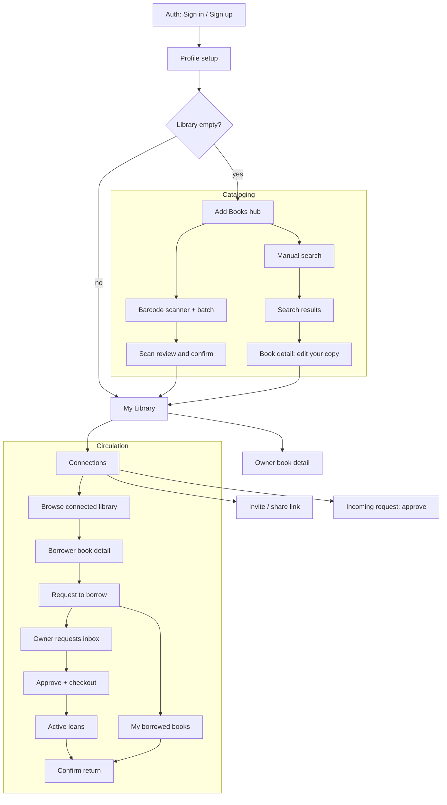

# Journeys and Screens (POC)

> **This is the POC cut.** The whole-app information architecture — full screen inventory across every feature area, the IA tree and navigation graph, the modal/overlay layer, and cross-role journey maps — lives in [`information-architecture.md`](information-architecture.md). This file is the tighter proof-of-concept critical path inside that superset. Screen IDs (L4, R1, …) are defined there.

**Scope:** the POC loop. Catalog, connect, and complete one request-to-return cycle between two real users.
**Frame:** mobile-first, single-column, thumb-reachable. Two roles, Steward and Borrower, but most people are both, so the app is one shell with modes rather than two apps.

Copy states referenced here are defined in `circulation/copy-state-model.md`.

---

## 1. Screen inventory

**[Core]** marks the POC critical path. **[Fast follow]** marks screens wanted immediately after but stubbable in the first prototype.

### Onboarding and identity
- **Welcome / value prop** [Core]. Answer "why bother." Lead with the neighborhood-library idea, not features.
- **Sign in / Sign up** [Core]. Supabase auth. Sign in with Apple as the primary path on iOS.
- **Profile setup** [Core, light]. Name, photo optional, approximate location. One screen.
- **First-run prompt** [Core]. "Let's add your first books." Routes straight into the scanner. The empty state doing real work.

### Cataloging (the core magic)
- **Add Books hub / method picker** [Core]. Scan, search by title, add manually. Scanner is the default.
- **Barcode scanner** [Core]. Live camera, batch mode with a running count and per-hit confirmation. The product's first impression. Highest polish.
- **Scan review and confirm** [Core]. The batch as an editable list. Remove misfires, resolve misses, confirm all at once. Never add silently.
- **Manual search** [Core]. Title or author input.
- **Search results** [Core]. Pick the right edition. Cover, title, author, year to disambiguate.
- **Book detail: edit your copy** [Core]. Canonical metadata read-only up top, then your copy: location, condition, status, visibility. Where an edition becomes your lendable copy.
- **Add success / continue** [Core, light]. Keeps momentum toward the next book.

### Library management
- **My Library** [Core]. Grid and list toggle, search within, filter by status. Home base.
- **Owner book detail** [Core]. Status, who has it, due date, lending history.
- **Empty library state** [Core].

### Connections and sharing
- **Connections list** [Core].
- **Invite** [Core]. Share link or code, plus contacts if native. How the second user gets in for the demo.
- **Incoming request: approve / decline** [Core]. Connection requests.
- **Sharing and visibility settings** [Fast follow]. Per library or per copy. POC ships one default of "visible to connections."

### Discovery and browse
- **Browse a connected library** [Core]. Availability shown per copy.
- **Search across connected libraries** [Fast follow]. "Who near me has this title."

### Circulation (the loop)
- **Borrower book detail** [Core]. Availability and a clear "Request to borrow."
- **Request sent / confirmation** [Core, light].
- **Requests inbox (owner)** [Core]. Incoming borrow requests, approve or decline.
- **Checkout action** [Core]. Owner marks it out, to whom, with an optional due date.
- **Active loans (owner)** [Core]. What is out, to whom, since when, due when (or open-ended).
- **My borrowed books (borrower)** [Core]. What I hold, due dates, and a return action.
- **Return action / confirm** [Core]. Borrower initiates, owner confirms.

### Shell and system
- **Tab bar / primary navigation** [Core]. Three destinations: Library · Browse · Profile. Add/Scan, Search, and Notifications are global tools, not tabs. See `information-architecture.md §1` for the full model and the decision behind it.
- **Notification center (bell)** [Core, in-app]. Header bell, everywhere: incoming requests, returns to confirm, connection requests, overdue flags — deep-links to the action. Replaces a Requests tab. In-app and pull-based for the POC (no push, no automation).
- **Settings / profile** [Fast follow, light].

**POC critical set is roughly 16 screens.**

---

## 2. Journey map: the Steward

| Stage | Goal | Actions | Screens | Mindset | Friction risk | Opportunity |
|---|---|---|---|---|---|---|
| Discover and decide | Understand why this is worth effort | Reads the pitch, signs up | Welcome, Sign up | Curious but skeptical | Value is abstract before neighbors are on it | Sell the catalog as standalone-useful so payoff is immediate |
| Onboard | Get in fast | Profile, location | Profile setup | Impatient to see value | Too many setup fields kills momentum | One-screen setup, approximate location only |
| Catalog | Get the shelf in without it feeling like data entry | Batch-scans, reviews, confirms | Scanner, Scan review, My Library | Make-or-break. Magic or chore | Slow scans, misses on older books, tedious confirmation | Batch scanning with instant feedback. A visible running count |
| Set up sharing | Control who sees what | Accepts a sensible default | (Stubbed for POC) | Cautious about exposure | Complex permission UI scares people off | Ship one safe default. Do not make them think |
| Invite a neighbor | Bring the loop to life | Sends an invite link | Connections, Invite | Slight social risk | Friction in the invite, or nobody to invite | Frictionless share link. Suggest who to invite |
| Receive a request | Feel the point of it | Sees a borrow request, approves | Requests inbox | Small delight | Missing the request | Clear badge and a satisfying approve action |
| Hand off | Lend cleanly | Marks checked out, optional due date | Checkout, Active loans | Wants it tracked | Forgetting who has what | Checkout one tap from the request |
| Get it back | Close the loop | Confirms the borrower's return | Owner book detail, Active loans | Relief, it worked | Awkwardness nudging a friend | Confirmation is one tap. Keep nudges human |
| Habit | Keep the catalog current | Scans new books as they arrive | Scanner | Wants low ongoing effort | Catalog goes stale | Make single-add as fast as batch |

---

## 3. Journey map: the Borrower

| Stage | Goal | Actions | Screens | Mindset | Friction risk | Opportunity |
|---|---|---|---|---|---|---|
| Connect | Get access to a shelf | Accepts an invite, signs up | Sign up, Incoming request | "What do they have?" | Onboarding before there is anything to browse | Drop them straight into the connected library after signup |
| Browse | Find something to read | Scans a connected library | Browse library, Search across | Discovery, low commitment | Thin shelves feel dead | Surface availability clearly |
| Request | Ask without friction | Taps request to borrow | Borrower book detail, Request sent | Mild social ask | Unclear if available, or awkward | Show availability plainly. One-tap, low-pressure ask |
| Receive | Get the book | Coordinates pickup | (Out of app for POC) | Anticipation | Handoff logistics live outside the app | Keep simple for POC |
| Read | Enjoy it | Nothing in app | My borrowed books | Content | Forgetting it is due | Passive due-date visibility |
| Return | Give it back | Marks returned, waits for confirmation | My borrowed books, Return | Wants to do right by the owner | Forgetting, or unclear how to close it | Easy return action |
| Come back | Borrow again | Returns to browse | Browse library | Habit forming | No reason to return if the shelf never changes | Notify when new books are added |

---

## 4. Screen flow

Owner and borrower paths shown together since one person does both.

---

## 5. What to prototype first

Sequence design work by risk, not by screen order.

1. **Cataloging flow: scanner, batch review, My Library.** Highest-risk, highest-magic interaction, and the thing that decides whether people finish onboarding. If this is not fast and satisfying, nothing downstream matters.
2. **The circulation loop: request, approve, checkout, return.** More conventional UX, but it is the concept. Make it clickable enough to walk someone through the story.
3. **Connections and browse.** The connective tissue. Simplest to design once the two above are solid.
